# Amazon EKS — The Complete Guide

> **In one sentence:** Amazon EKS is AWS's managed Kubernetes service — AWS runs and scales the Kubernetes **control plane** for you, while you run your **workloads** on nodes (EC2 or Fargate), wiring in AWS networking, security, autoscaling (Karpenter), backup, DR, and observability (OpenTelemetry).

This guide goes from *"what is EKS"* to a production-grade architecture — networking, Karpenter, security, disaster recovery, backup, and OpenTelemetry.

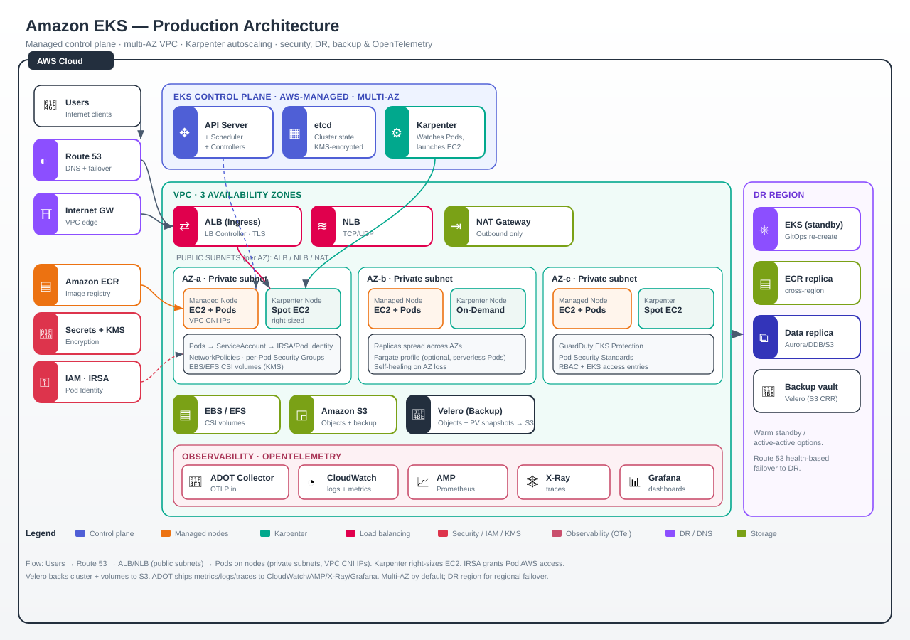

*The full picture: users enter via Route 53 and load balancers in public subnets; Pods run on managed + Karpenter nodes in private subnets across 3 AZs; security, storage, backup, observability, and a DR region wrap around it. Each section below unpacks one part of this diagram.*

---

## 1. What is Kubernetes, and what is EKS?

**Kubernetes (K8s)** is an open-source system for running containers across a fleet of machines. It handles scheduling, self-healing, scaling, service discovery, and rollouts. It has two halves:

- **Control plane** — the "brain": the API server, scheduler, controller manager, and `etcd` (the cluster state database).
- **Data plane** — the "muscle": the worker **nodes** that actually run your containers (grouped into **Pods**).

**Amazon EKS (Elastic Kubernetes Service)** is AWS running the Kubernetes control plane *for you* — highly available across 3 Availability Zones, patched, and scaled automatically. You stop babysitting `etcd` and API servers, and focus on your workloads.

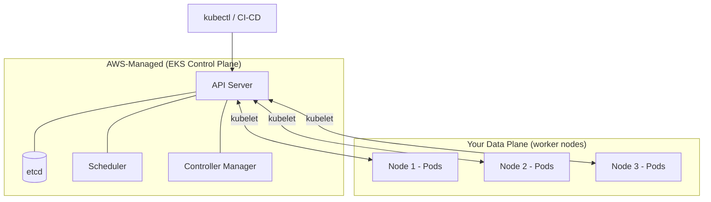

| Layer | Who manages it | What's in it |
|-------|----------------|--------------|
| **Control plane** | **AWS** (managed) | API server, etcd, scheduler, controllers — multi-AZ, auto-patched |
| **Data plane** | **You** | Worker nodes, Pods, your applications |

---

## 2. Core Kubernetes objects (the vocabulary)

| Object | What it is |
|--------|-----------|
| **Pod** | Smallest deployable unit — one or more containers sharing network/storage |
| **Deployment** | Declares "I want N replicas of this Pod"; handles rollouts + self-healing |
| **ReplicaSet** | Keeps the desired number of Pods running (managed by Deployment) |
| **Service** | Stable network endpoint + load balancing across Pods |
| **Ingress** | HTTP(S) routing rules into the cluster (backed by a load balancer) |
| **ConfigMap / Secret** | Non-secret / secret configuration injected into Pods |
| **Namespace** | Virtual cluster boundary for isolating teams/environments |
| **Node** | A worker machine (EC2 instance or Fargate micro-VM) |

---

## 3. Node options: how your Pods actually run

EKS gives you three ways to provide compute for Pods:

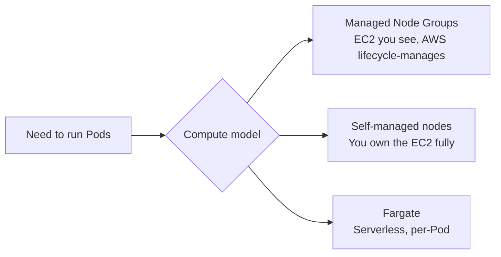

| Option | You manage | Best for |
|--------|-----------|----------|
| **Managed Node Groups** | AWS provisions/updates EC2 for you | Most workloads — the default choice |
| **Self-managed nodes** | You own the EC2 and AMIs | Special OS/GPU/customization needs |
| **AWS Fargate** | Nothing — serverless per-Pod | Spiky, isolated, "no-ops" workloads |

---

## 4. Networking — the part everyone underestimates

Networking is where EKS meets the VPC. Get this right and everything else is easier.

### 4.1 The VPC layout

A production EKS cluster lives in a **VPC** spanning **3 Availability Zones**, with **public** and **private** subnets in each:

- **Public subnets** — hold internet-facing load balancers and NAT Gateways. Have a route to the **Internet Gateway (IGW)**.
- **Private subnets** — hold your worker nodes and Pods. Reach the internet *outbound only* via **NAT Gateway**. Not directly reachable from the internet.

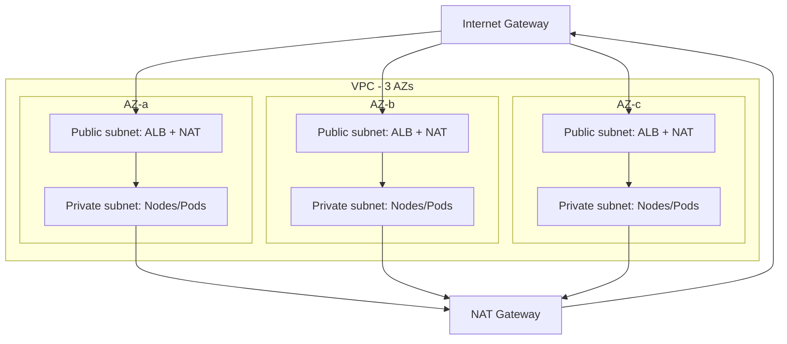

### 4.2 The Amazon VPC CNI

EKS uses the **Amazon VPC CNI plugin** so that **each Pod gets a real VPC IP address** from your subnets. This means Pods are first-class citizens on your network — security groups, flow logs, and routing all "just work." Plan your subnet CIDR ranges generously, because Pods consume IPs fast.

### 4.3 Getting traffic in

| Path | AWS resource | Use for |
|------|-------------|---------|
| **Service type LoadBalancer** | **NLB** (Network Load Balancer) | TCP/UDP, high throughput |
| **Ingress** | **ALB** via the **AWS Load Balancer Controller** | HTTP(S) routing, path/host rules, TLS |
| **Service type ClusterIP** | internal only | Pod-to-Pod inside the cluster |

The **AWS Load Balancer Controller** runs in the cluster and provisions ALBs/NLBs automatically from your Ingress/Service definitions.

---

## 5. Karpenter — smart, fast autoscaling

**Karpenter** is an open-source, AWS-built node autoscaler that replaces the older Cluster Autoscaler. Instead of scaling fixed node groups, Karpenter looks at **pending Pods** and launches **right-sized EC2 instances** in seconds to fit them — then removes them when no longer needed.

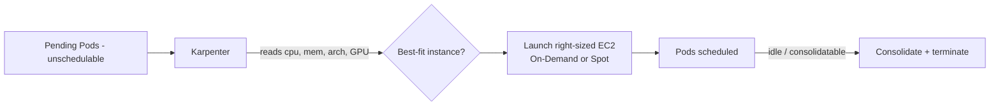

**Why teams love it:**
- **Fast** — provisions capacity in seconds, not minutes.
- **Right-sizing** — picks instance types that fit the actual Pod requests instead of a pre-baked node group shape.
- **Cost** — first-class **Spot** support and **consolidation** (bin-packing Pods onto fewer nodes, terminating waste).
- **Simple** — you define `NodePool` + `EC2NodeClass` CRDs; no juggling many node groups.

| | Cluster Autoscaler | Karpenter |
|---|---|---|
| Scales | Fixed node groups (ASGs) | Any instance type on demand |
| Speed | Minutes | Seconds |
| Right-sizing | Limited | Yes — best-fit per workload |
| Spot / consolidation | Manual | Built-in |

---

## 6. Choosing a CNI — VPC CNI vs Calico vs Cilium

The **CNI (Container Network Interface)** plugin decides how Pods get networking and how network policy is enforced. On EKS you have three common choices, and they solve different problems.

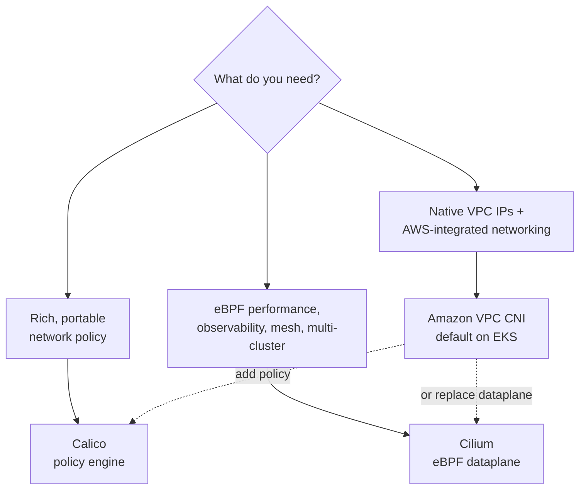

### 6.1 The three options

| | **Amazon VPC CNI** | **Calico** | **Cilium** |
|---|---|---|---|
| **What it is** | AWS default CNI | Network policy engine (often layered on VPC CNI) | eBPF-based CNI + policy + observability |
| **Pod IPs** | Real VPC IPs (native) | Uses VPC CNI for IPAM (typical on EKS) | Overlay or VPC-native (ENI mode) |
| **Network policy** | Basic (via add-on) | **Rich** — global, namespaced, DNS, tiers | **Rich** — L3/L4 **and L7 (HTTP)**, identity-based |
| **Data plane** | iptables/route | iptables or eBPF | **eBPF** (fast, no iptables sprawl) |
| **Observability** | CloudWatch/flow logs | Basic | **Hubble** — deep flow visibility |
| **Extras** | AWS-native SG per Pod | Mature policy tiers | Service mesh, multi-cluster, encryption |

### 6.2 When to use what

- **Amazon VPC CNI (default):** you want Pods as first-class VPC citizens, security-group-per-Pod, and the least operational overhead. Great for most teams. Add the **network policy add-on** for basic policies.
- **Calico:** you need **advanced, portable NetworkPolicy** (tiered rules, global policies, DNS-based egress) and want a battle-tested policy engine. Common when policy requirements outgrow the VPC CNI add-on. Often runs **for policy** while VPC CNI still does IP assignment.
- **Cilium:** you want **eBPF performance**, **L7-aware policy** (allow only `GET /health`), rich flow observability via **Hubble**, transparent encryption, or service-mesh / multi-cluster features. Pick it when networking is a first-class concern and you'll invest in it.

> **Rule of thumb:** Start with **VPC CNI** (+ policy add-on). Move to **Calico** when you need serious policy, or **Cilium** when you need eBPF speed, L7 policy, and observability.

---

## 7. Ingress & Egress — secured traffic flow

Networking people describe cluster traffic with a **compass model**:
- **North-South** — traffic crossing the cluster boundary. **North = ingress** (into the cluster), **South = egress** (out of the cluster).
- **East-West** — traffic *between* services **inside** the cluster (Pod-to-Pod, service-to-service).

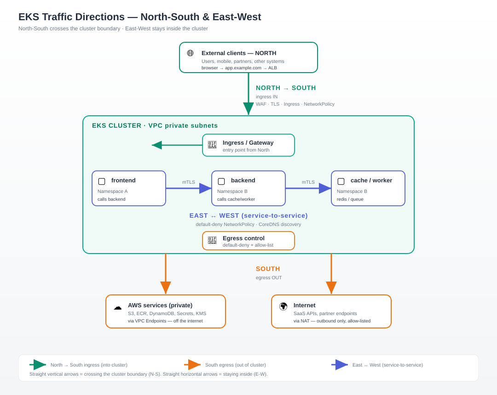

### 7.1 The compass model at a glance

| Direction | What it is | Concrete calls | Primary controls |
|-----------|-----------|----------------|------------------|
| **North → South (ingress)** | External clients calling *into* the cluster | User browser → `app.example.com` → ALB → Ingress → frontend Pod | WAF/Shield, TLS on ALB, Ingress rules, NetworkPolicy "allow from ingress" |
| **North → South (egress)** | Pods calling *out* to external destinations | Pod → S3/ECR (AWS), Pod → Stripe/SaaS API (internet) | Default-deny egress + FQDN allow-list, **VPC Endpoints** for AWS, NAT for internet |
| **East ↔ West** | Service-to-service *inside* the cluster | frontend → backend → cache/worker; cross-namespace calls | **mTLS** (mesh/Cilium), default-deny NetworkPolicy, CoreDNS service discovery |

**Why the distinction matters:**
- **North-South** is your *perimeter* — it's where WAF, TLS, and load balancers live. Historically this got all the security attention.
- **East-West** is your *interior* — and it's where breaches spread. A compromised frontend Pod shouldn't be able to reach the database Pod unless explicitly allowed. That's why modern EKS uses **zero-trust east-west**: default-deny NetworkPolicies + mTLS, so every internal hop is authenticated and authorized, not just trusted because it's "inside."

> **Mental model:** North-South guards the *door*; East-West guards every *room inside*. You need both.

---

### 7.2 Ingress — external → Pod (defense in depth)

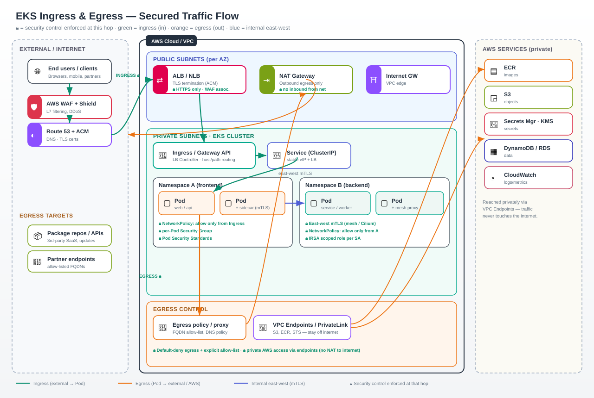

*🔒 marks where a security control is enforced. Green = ingress, orange = egress, blue = internal east-west.*

Every hop adds a control, so a bad request is filtered as early as possible:

| Hop | Component | Security enforced |
|-----|-----------|-------------------|
| 1 | **AWS WAF + Shield** | L7 filtering (SQLi/XSS, rate limits), DDoS protection |
| 2 | **Route 53 + ACM** | DNS resolution; **TLS certificate** issuance |
| 3 | **ALB / NLB** (public subnet) | **TLS termination (HTTPS only)**, WAF association, health checks |
| 4 | **Ingress / Gateway API** | Host/path routing via the AWS Load Balancer Controller |
| 5 | **Service (ClusterIP)** | Stable virtual IP, load-balances to healthy Pods |
| 6 | **Pod** (private subnet) | **NetworkPolicy** (allow only from Ingress), per-Pod SG, Pod Security Standards |

The key idea: **only load balancers live in public subnets; Pods live in private subnets** and are never directly reachable from the internet.

### 7.3 East-west — service-to-service (internal view)

Inside the cluster, traffic between Pods should be **zero-trust**, not open by default:

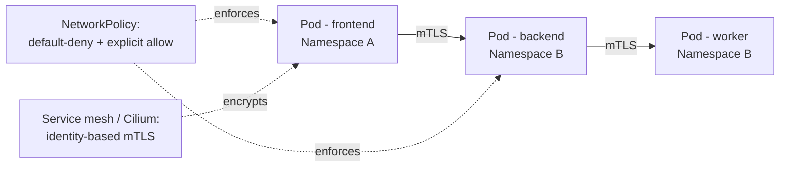

- **NetworkPolicies** — start with **default-deny**, then allow only the specific Pod-to-Pod paths you need (e.g. frontend → backend, nothing else).
- **mTLS** — a service mesh (Istio/App Mesh) or **Cilium** gives mutual TLS + identity between services, so traffic is encrypted and authenticated even inside the VPC.
- **IRSA per ServiceAccount** — each workload gets only the AWS permissions it needs.

### 7.4 Egress — Pod → external (controlled, not wide-open)

By default a Pod can reach anything the NAT allows. Lock this down:

| Path | How | Security enforced |
|------|-----|-------------------|
| **To AWS services** (S3, ECR, STS, DynamoDB, CloudWatch) | **VPC Endpoints / PrivateLink** | Traffic **stays on the AWS network** — never touches the internet |
| **To the internet** (SaaS, partner APIs) | **NAT Gateway** in public subnet | Outbound only; **no inbound** from the internet |
| **Egress filtering** | **Egress NetworkPolicy / egress proxy** | **Default-deny egress** + **FQDN allow-list** (only approved domains) |

**Best practices:**
- Prefer **VPC Endpoints** for AWS services — cheaper, faster, and private (no NAT, no internet path).
- Apply **default-deny egress** and allow-list only the external FQDNs a workload legitimately needs — this contains data-exfiltration and blast radius if a Pod is compromised.
- Route internet-bound egress through a **NAT Gateway** (or an egress proxy for inspection/logging).

> **Rule of thumb:** Ingress is filtered top-down (WAF → TLS → policy); egress is **deny-by-default** with explicit allow-lists; AWS-bound traffic goes private via **VPC Endpoints**; east-west is **zero-trust with mTLS**.

---

## 8. Scalability — HPA, VPA, KEDA & Karpenter

Scaling in Kubernetes happens on **two axes**: scaling **Pods** (more/bigger replicas) and scaling **Nodes** (more capacity to place them). Use the right tool for each.

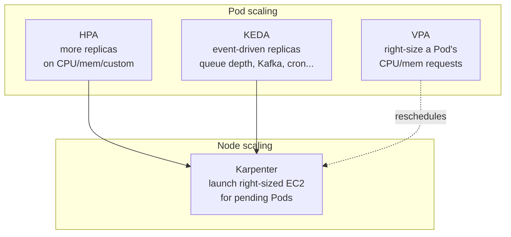

### 8.1 The tools

| Tool | Axis | Scales on | Best for |
|------|------|-----------|----------|
| **HPA** (Horizontal Pod Autoscaler) | Pods (out) | CPU, memory, or **custom/metrics** | Steady traffic that grows with load |
| **VPA** (Vertical Pod Autoscaler) | Pods (up) | Actual usage → adjusts requests/limits | Right-sizing; workloads you can't shard |
| **KEDA** (Kubernetes Event-Driven Autoscaling) | Pods (out) | **Events**: SQS/Kafka depth, Prometheus, cron, 50+ scalers | Bursty/async work, **scale-to-zero** |
| **Karpenter** | Nodes | Pending (unschedulable) Pods | Providing the compute HPA/KEDA need |

### 8.2 How they work together

A real pipeline usually combines them: **KEDA or HPA** decides *how many Pods*, and when those Pods can't fit, **Karpenter** launches *right-sized nodes* in seconds. **VPA** keeps each Pod's requests accurate so bin-packing stays efficient.

- **HPA vs VPA:** don't run both on **CPU/memory** for the same workload (they fight). HPA on custom metrics + VPA on requests can coexist.
- **KEDA vs HPA:** KEDA actually *builds on* HPA under the hood but adds event sources and **scale-to-zero** — ideal for queue workers and cron jobs.

> **Rule of thumb:** **HPA** for request-driven services, **KEDA** for event/queue-driven and scale-to-zero, **VPA** for right-sizing, **Karpenter** underneath to supply nodes.

---

## 9. Cluster upgrades

EKS releases a new Kubernetes version regularly, and each version is supported for a limited window — so upgrades are a recurring, planned activity, not a one-off.

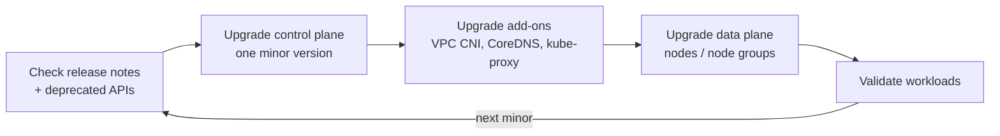

**Key rules:**
- **One minor version at a time** (e.g. 1.30 → 1.31), control plane first, then nodes. Skipping isn't allowed.
- **Node upgrades** roll gracefully: managed node groups **cordon + drain** old nodes while new ones join; Karpenter nodes are replaced via **drift/disruption**. `PodDisruptionBudgets` keep enough replicas alive during the roll.
- **Check deprecated APIs** before upgrading (tools like `kubent`/`pluto`) so manifests don't break on the new version.
- **Add-ons matter:** keep VPC CNI, CoreDNS, and kube-proxy compatible with the target version.
- **Blue/green cluster** upgrades (stand up a new cluster, shift traffic) are an option for very high-stakes, low-risk-tolerance environments.

| Approach | How | Risk |
|----------|-----|------|
| **In-place** | Upgrade control plane + roll nodes in the same cluster | Standard, lower effort |
| **Blue/green cluster** | New cluster on target version, migrate workloads, shift DNS | Safest rollback, more effort |

---

## 10. Deployment strategies

How you ship a new version of an app into the cluster determines your blast radius if something's wrong.

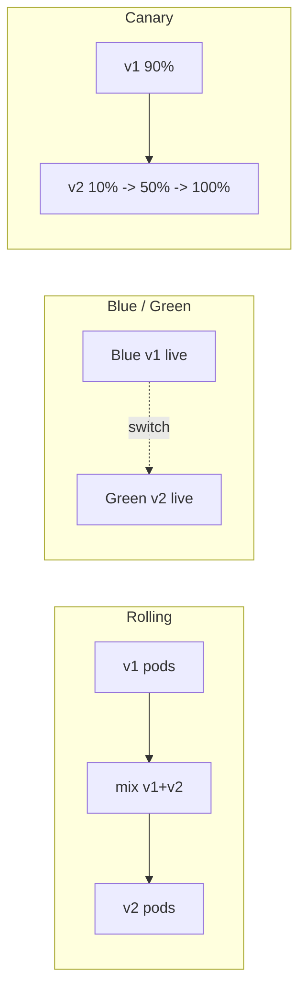

| Strategy | How it works | Trade-off |
|----------|-------------|-----------|
| **Rolling update** (K8s default) | Replace Pods gradually, respecting `maxUnavailable`/`maxSurge` | Simple; brief version mix |
| **Blue/Green** | Run v2 alongside v1, flip traffic at once | Instant rollback; 2x resources during cutover |
| **Canary** | Send a small % of traffic to v2, ramp up if healthy | Safest for risk; needs traffic-splitting |
| **Feature-flagged** | Ship code dark, toggle at runtime | Decouples deploy from release; app complexity |

**Tooling on EKS:**
- **GitOps** — **Argo CD** or **Flux** reconcile the cluster to what's declared in Git. The repo is the source of truth (also the backbone of DR re-creation).
- **Progressive delivery** — **Argo Rollouts** or **Flagger** automate canary/blue-green with metric-based promotion and automatic rollback.
- **Ingress/mesh traffic splitting** — ALB weighted target groups, or a service mesh (Istio/Cilium/App Mesh) for fine-grained canaries.

> **Rule of thumb:** Rolling for everyday changes, **canary** (via Argo Rollouts/Flagger) for risky ones, **blue/green** when you need instant rollback — all driven by **GitOps**.

---

## 11. Security — defense in depth

EKS security spans identity, network, secrets, and the nodes themselves.

### 11.1 Identity: how Pods get AWS permissions

Never bake AWS access keys into containers. Give a Pod an IAM role instead. Two mechanisms:

- **IRSA (IAM Roles for Service Accounts)** — maps a Kubernetes ServiceAccount to an IAM role via an OIDC provider. Long-standing, widely supported.
- **EKS Pod Identity** — a newer, simpler association managed by an EKS add-on; no per-cluster OIDC juggling.

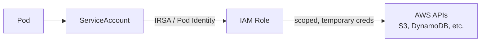

### 11.2 Layered controls

| Layer | Control | What it does |
|-------|---------|-------------|
| **Cluster API access** | **Kubernetes RBAC** + EKS access entries | Who can call the K8s API and do what |
| **AWS access** | **IAM + IRSA / Pod Identity** | What AWS resources Pods/nodes can touch |
| **Pod-to-Pod traffic** | **NetworkPolicies** (VPC CNI) | Restrict which Pods can talk to which |
| **Node/Pod network** | **Security Groups** (incl. per-Pod SGs) | Firewall at the ENI level |
| **Secrets** | **AWS Secrets Manager / SSM** + **KMS** | Store + encrypt secrets; envelope encryption of `etcd` |
| **Images** | **Amazon ECR** + image scanning | Signed, scanned images from a private registry |
| **Runtime** | **GuardDuty EKS Protection**, Pod Security Standards | Threat detection + hardening baselines |

### 11.3 Encryption

- **Secrets envelope encryption** — encrypt Kubernetes Secrets in `etcd` with a **KMS** key.
- **In transit** — TLS to the API server; mTLS between services if you add a service mesh.
- **At rest** — EBS/EFS volumes encrypted with KMS.

---

## 12. Storage

Pods are ephemeral; data needs somewhere durable to live.

| Driver / service | Backed by | Use for |
|------------------|-----------|---------|
| **EBS CSI driver** | Amazon EBS | Single-node read/write, databases, stateful sets |
| **EFS CSI driver** | Amazon EFS | Shared read/write across many Pods/AZs |
| **S3 (via app SDK / Mountpoint)** | Amazon S3 | Object storage, large artifacts, backups |

Persistent storage is requested with a **PersistentVolumeClaim (PVC)**; the CSI driver provisions the underlying AWS volume automatically.

---

## 13. Disaster Recovery (DR)

DR is about surviving the loss of a zone — or an entire region.

### 13.1 Multi-AZ (baseline, always do this)

Spread nodes across **3 AZs** and run multiple replicas. If one AZ fails, the scheduler reschedules Pods onto healthy AZs. The EKS control plane is already multi-AZ by default.

### 13.2 Multi-Region (for serious RTO/RPO targets)

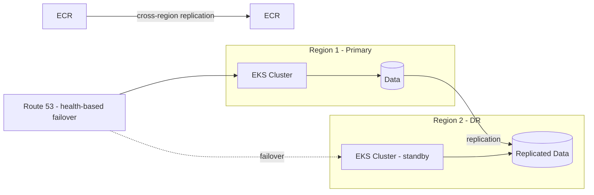

| Pattern | RTO / RPO | Cost |
|---------|-----------|------|
| **Backup & restore** | Hours / hours | Lowest |
| **Pilot light** | Tens of minutes | Low |
| **Warm standby** | Minutes | Medium |
| **Active-active** | Near-zero | Highest |

Key ingredients: **GitOps** (ArgoCD/Flux) so the whole cluster is re-creatable from Git, **ECR cross-region replication** for images, **data replication** (Aurora Global, DynamoDB Global Tables, S3 CRR), and **Route 53** for failover routing.

---

## 14. Backup — Velero

Multi-AZ protects against hardware failure; **backup** protects against *mistakes* (a bad deploy, an accidental `delete`) and enables migration.

**Velero** is the standard tool. It backs up:
- **Kubernetes objects** (Deployments, Services, ConfigMaps, etc.) — snapshotted to **Amazon S3**.
- **Persistent volumes** — via **EBS/EFS snapshots** or file-level copy.

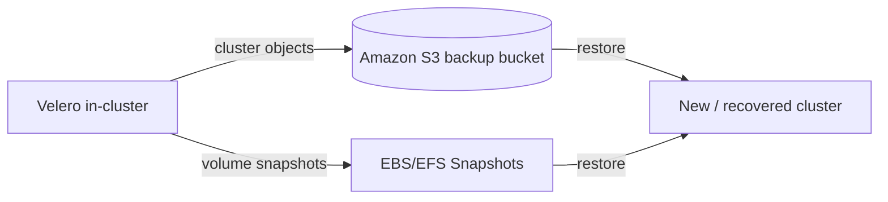

**Good practice:** scheduled backups, cross-region backup bucket, tested restores (a backup you've never restored is a hope, not a plan), and separate schedules for critical namespaces.

---

## 15. Observability with OpenTelemetry (OTel)

You can't operate what you can't see. Modern EKS observability standardizes on **OpenTelemetry** — a vendor-neutral standard for the three signals: **metrics, logs, and traces**.

### 15.1 The pipeline

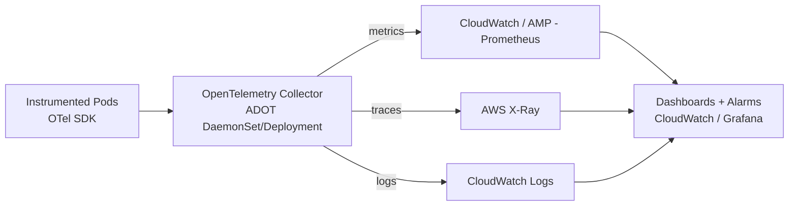

- **ADOT (AWS Distro for OpenTelemetry)** — AWS's supported build of the OTel Collector, deployed as an EKS add-on. It receives telemetry and exports to AWS backends.
- **Metrics** → **Amazon Managed Prometheus (AMP)** or **CloudWatch**.
- **Traces** → **AWS X-Ray** (or any OTLP-compatible backend).
- **Logs** → **CloudWatch Logs** (via Fluent Bit / OTel).
- **Visualize** → **Amazon Managed Grafana** or CloudWatch dashboards.

### 15.2 Why OTel instead of proprietary agents

| | Proprietary agent | OpenTelemetry |
|---|---|---|
| Lock-in | High | None — swap backends freely |
| Signals | Often one | Metrics + logs + traces, unified |
| Standard | Vendor-specific | CNCF standard, broad support |
| AWS support | Varies | First-class via ADOT |

---

## 16. Putting it all together — production checklist

- **Cluster:** EKS control plane (managed, multi-AZ); GitOps (ArgoCD/Flux) as source of truth.
- **Compute:** Managed Node Groups for baseline + **Karpenter** for elastic, right-sized, Spot-friendly scaling.
- **Networking:** VPC across 3 AZs, public/private subnets, IGW + NAT, **VPC CNI** (add **Calico** for policy or **Cilium** for eBPF/L7), **AWS Load Balancer Controller** (ALB/NLB), NetworkPolicies.
- **Traffic:** ingress via WAF/Shield → TLS on ALB → Ingress → Pod; **default-deny egress** + FQDN allow-list; **VPC Endpoints** for private AWS access; east-west **mTLS**.
- **Scaling:** **HPA** for request-driven, **KEDA** for event-driven + scale-to-zero, **VPA** for right-sizing, **Karpenter** for nodes.
- **Security:** IRSA / Pod Identity, RBAC, per-Pod security groups, Secrets Manager + KMS, ECR image scanning, GuardDuty EKS Protection.
- **Storage:** EBS/EFS CSI drivers, PVCs, KMS-encrypted volumes.
- **Upgrades:** one minor version at a time, control plane → add-ons → nodes; check deprecated APIs; PodDisruptionBudgets.
- **Deployment:** GitOps (Argo CD/Flux); rolling by default, **canary/blue-green** via Argo Rollouts/Flagger for risky changes.
- **DR:** multi-AZ by default; multi-region (warm standby/active-active) with data replication + Route 53 failover.
- **Backup:** **Velero** to S3 + volume snapshots, cross-region, restore-tested.
- **Observability:** **OpenTelemetry** via **ADOT** → CloudWatch / AMP / X-Ray / Managed Grafana.

---

## Resources

- [Amazon EKS documentation](https://docs.aws.amazon.com/eks/) *(content rephrased from official AWS docs for compliance)*
- [Karpenter](https://karpenter.sh/)
- [Calico](https://docs.tigera.io/) · [Cilium](https://cilium.io/)
- [KEDA](https://keda.sh/) · [Argo Rollouts](https://argoproj.github.io/rollouts/) · [Flagger](https://flagger.app/)
- [Velero](https://velero.io/)
- [AWS Distro for OpenTelemetry (ADOT)](https://aws-otel.github.io/)

*This is a conceptual reference guide; validate specifics (versions, limits, service names) against current AWS documentation before relying on them in production.*
