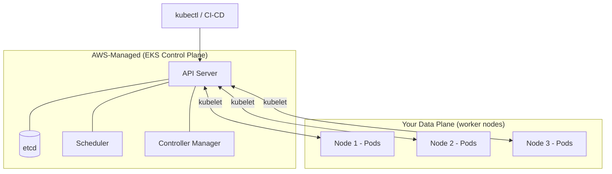
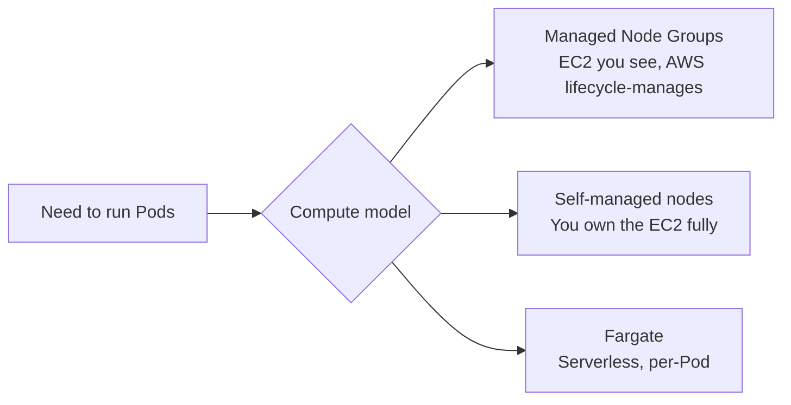
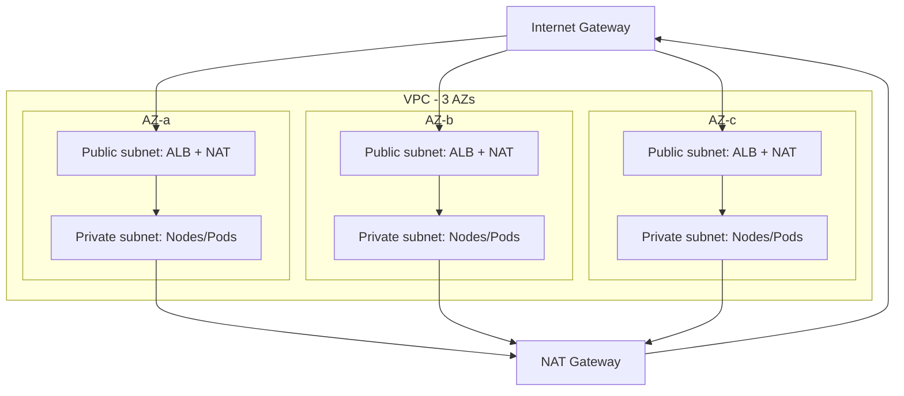
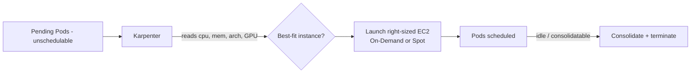
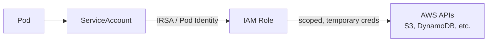
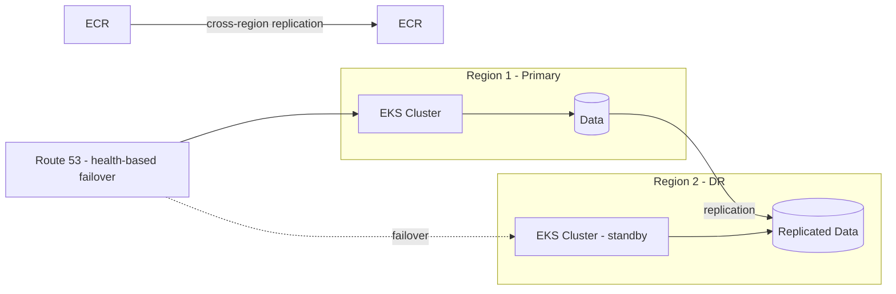
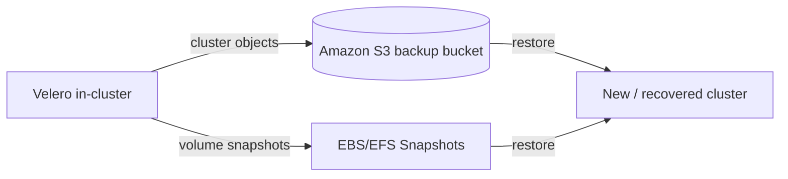
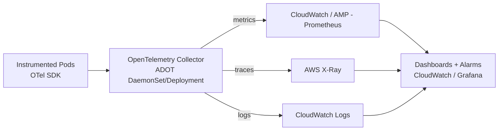

# Amazon EKS — The Complete Guide

> **In one sentence:** Amazon EKS is AWS's managed Kubernetes service — AWS runs and scales the Kubernetes **control plane** for you, while you run your **workloads** on nodes (EC2 or Fargate), wiring in AWS networking, security, autoscaling (Karpenter), backup, DR, and observability (OpenTelemetry).

This guide goes from *"what is EKS"* to a production-grade architecture — networking, Karpenter, security, disaster recovery, backup, and OpenTelemetry.

*The full picture: users enter via Route 53 and load balancers in public subnets; Pods run on managed + Karpenter nodes in private subnets across 3 AZs; security, storage, backup, observability, and a DR region wrap around it. Each section below unpacks one part of this diagram.*

---

## 1. What is Kubernetes, and what is EKS?

**Kubernetes (K8s)** is an open-source system for running containers across a fleet of machines. It handles scheduling, self-healing, scaling, service discovery, and rollouts. It has two halves:

- **Control plane** — the "brain": the API server, scheduler, controller manager, and `etcd` (the cluster state database).
- **Data plane** — the "muscle": the worker **nodes** that actually run your containers (grouped into **Pods**).

**Amazon EKS (Elastic Kubernetes Service)** is AWS running the Kubernetes control plane *for you* — highly available across 3 Availability Zones, patched, and scaled automatically. You stop babysitting `etcd` and API servers, and focus on your workloads.

| Layer | Who manages it | What's in it |
|-------|----------------|--------------|
| **Control plane** | **AWS** (managed) | API server, etcd, scheduler, controllers — multi-AZ, auto-patched |
| **Data plane** | **You** | Worker nodes, Pods, your applications |

---

## 2. Core Kubernetes objects (the vocabulary)

| Object | What it is |
|--------|-----------|
| **Pod** | Smallest deployable unit — one or more containers sharing network/storage |
| **Deployment** | Declares "I want N replicas of this Pod"; handles rollouts + self-healing |
| **ReplicaSet** | Keeps the desired number of Pods running (managed by Deployment) |
| **Service** | Stable network endpoint + load balancing across Pods |
| **Ingress** | HTTP(S) routing rules into the cluster (backed by a load balancer) |
| **ConfigMap / Secret** | Non-secret / secret configuration injected into Pods |
| **Namespace** | Virtual cluster boundary for isolating teams/environments |
| **Node** | A worker machine (EC2 instance or Fargate micro-VM) |

---

## 3. Node options: how your Pods actually run

EKS gives you three ways to provide compute for Pods:

| Option | You manage | Best for |
|--------|-----------|----------|
| **Managed Node Groups** | AWS provisions/updates EC2 for you | Most workloads — the default choice |
| **Self-managed nodes** | You own the EC2 and AMIs | Special OS/GPU/customization needs |
| **AWS Fargate** | Nothing — serverless per-Pod | Spiky, isolated, "no-ops" workloads |

---

## 4. Networking — the part everyone underestimates

Networking is where EKS meets the VPC. Get this right and everything else is easier.

### 4.1 The VPC layout

A production EKS cluster lives in a **VPC** spanning **3 Availability Zones**, with **public** and **private** subnets in each:

- **Public subnets** — hold internet-facing load balancers and NAT Gateways. Have a route to the **Internet Gateway (IGW)**.
- **Private subnets** — hold your worker nodes and Pods. Reach the internet *outbound only* via **NAT Gateway**. Not directly reachable from the internet.

### 4.2 The Amazon VPC CNI

EKS uses the **Amazon VPC CNI plugin** so that **each Pod gets a real VPC IP address** from your subnets. This means Pods are first-class citizens on your network — security groups, flow logs, and routing all "just work." Plan your subnet CIDR ranges generously, because Pods consume IPs fast.

### 4.3 Getting traffic in

| Path | AWS resource | Use for |
|------|-------------|---------|
| **Service type LoadBalancer** | **NLB** (Network Load Balancer) | TCP/UDP, high throughput |
| **Ingress** | **ALB** via the **AWS Load Balancer Controller** | HTTP(S) routing, path/host rules, TLS |
| **Service type ClusterIP** | internal only | Pod-to-Pod inside the cluster |

The **AWS Load Balancer Controller** runs in the cluster and provisions ALBs/NLBs automatically from your Ingress/Service definitions.

---

## 5. Karpenter — smart, fast autoscaling

**Karpenter** is an open-source, AWS-built node autoscaler that replaces the older Cluster Autoscaler. Instead of scaling fixed node groups, Karpenter looks at **pending Pods** and launches **right-sized EC2 instances** in seconds to fit them — then removes them when no longer needed.

**Why teams love it:**
- **Fast** — provisions capacity in seconds, not minutes.
- **Right-sizing** — picks instance types that fit the actual Pod requests instead of a pre-baked node group shape.
- **Cost** — first-class **Spot** support and **consolidation** (bin-packing Pods onto fewer nodes, terminating waste).
- **Simple** — you define `NodePool` + `EC2NodeClass` CRDs; no juggling many node groups.

| | Cluster Autoscaler | Karpenter |
|---|---|---|
| Scales | Fixed node groups (ASGs) | Any instance type on demand |
| Speed | Minutes | Seconds |
| Right-sizing | Limited | Yes — best-fit per workload |
| Spot / consolidation | Manual | Built-in |

---

## 6. Security — defense in depth

EKS security spans identity, network, secrets, and the nodes themselves.

### 6.1 Identity: how Pods get AWS permissions

Never bake AWS access keys into containers. Give a Pod an IAM role instead. Two mechanisms:

- **IRSA (IAM Roles for Service Accounts)** — maps a Kubernetes ServiceAccount to an IAM role via an OIDC provider. Long-standing, widely supported.
- **EKS Pod Identity** — a newer, simpler association managed by an EKS add-on; no per-cluster OIDC juggling.

### 6.2 Layered controls

| Layer | Control | What it does |
|-------|---------|-------------|
| **Cluster API access** | **Kubernetes RBAC** + EKS access entries | Who can call the K8s API and do what |
| **AWS access** | **IAM + IRSA / Pod Identity** | What AWS resources Pods/nodes can touch |
| **Pod-to-Pod traffic** | **NetworkPolicies** (VPC CNI) | Restrict which Pods can talk to which |
| **Node/Pod network** | **Security Groups** (incl. per-Pod SGs) | Firewall at the ENI level |
| **Secrets** | **AWS Secrets Manager / SSM** + **KMS** | Store + encrypt secrets; envelope encryption of `etcd` |
| **Images** | **Amazon ECR** + image scanning | Signed, scanned images from a private registry |
| **Runtime** | **GuardDuty EKS Protection**, Pod Security Standards | Threat detection + hardening baselines |

### 6.3 Encryption

- **Secrets envelope encryption** — encrypt Kubernetes Secrets in `etcd` with a **KMS** key.
- **In transit** — TLS to the API server; mTLS between services if you add a service mesh.
- **At rest** — EBS/EFS volumes encrypted with KMS.

---

## 7. Storage

Pods are ephemeral; data needs somewhere durable to live.

| Driver / service | Backed by | Use for |
|------------------|-----------|---------|
| **EBS CSI driver** | Amazon EBS | Single-node read/write, databases, stateful sets |
| **EFS CSI driver** | Amazon EFS | Shared read/write across many Pods/AZs |
| **S3 (via app SDK / Mountpoint)** | Amazon S3 | Object storage, large artifacts, backups |

Persistent storage is requested with a **PersistentVolumeClaim (PVC)**; the CSI driver provisions the underlying AWS volume automatically.

---

## 8. Disaster Recovery (DR)

DR is about surviving the loss of a zone — or an entire region.

### 8.1 Multi-AZ (baseline, always do this)

Spread nodes across **3 AZs** and run multiple replicas. If one AZ fails, the scheduler reschedules Pods onto healthy AZs. The EKS control plane is already multi-AZ by default.

### 8.2 Multi-Region (for serious RTO/RPO targets)

| Pattern | RTO / RPO | Cost |
|---------|-----------|------|
| **Backup & restore** | Hours / hours | Lowest |
| **Pilot light** | Tens of minutes | Low |
| **Warm standby** | Minutes | Medium |
| **Active-active** | Near-zero | Highest |

Key ingredients: **GitOps** (ArgoCD/Flux) so the whole cluster is re-creatable from Git, **ECR cross-region replication** for images, **data replication** (Aurora Global, DynamoDB Global Tables, S3 CRR), and **Route 53** for failover routing.

---

## 9. Backup — Velero

Multi-AZ protects against hardware failure; **backup** protects against *mistakes* (a bad deploy, an accidental `delete`) and enables migration.

**Velero** is the standard tool. It backs up:
- **Kubernetes objects** (Deployments, Services, ConfigMaps, etc.) — snapshotted to **Amazon S3**.
- **Persistent volumes** — via **EBS/EFS snapshots** or file-level copy.

**Good practice:** scheduled backups, cross-region backup bucket, tested restores (a backup you've never restored is a hope, not a plan), and separate schedules for critical namespaces.

---

## 10. Observability with OpenTelemetry (OTel)

You can't operate what you can't see. Modern EKS observability standardizes on **OpenTelemetry** — a vendor-neutral standard for the three signals: **metrics, logs, and traces**.

### 10.1 The pipeline

- **ADOT (AWS Distro for OpenTelemetry)** — AWS's supported build of the OTel Collector, deployed as an EKS add-on. It receives telemetry and exports to AWS backends.
- **Metrics** → **Amazon Managed Prometheus (AMP)** or **CloudWatch**.
- **Traces** → **AWS X-Ray** (or any OTLP-compatible backend).
- **Logs** → **CloudWatch Logs** (via Fluent Bit / OTel).
- **Visualize** → **Amazon Managed Grafana** or CloudWatch dashboards.

### 10.2 Why OTel instead of proprietary agents

| | Proprietary agent | OpenTelemetry |
|---|---|---|
| Lock-in | High | None — swap backends freely |
| Signals | Often one | Metrics + logs + traces, unified |
| Standard | Vendor-specific | CNCF standard, broad support |
| AWS support | Varies | First-class via ADOT |

---

## 11. Putting it all together — production checklist

- **Cluster:** EKS control plane (managed, multi-AZ); GitOps (ArgoCD/Flux) as source of truth.
- **Compute:** Managed Node Groups for baseline + **Karpenter** for elastic, right-sized, Spot-friendly scaling.
- **Networking:** VPC across 3 AZs, public/private subnets, IGW + NAT, VPC CNI, **AWS Load Balancer Controller** (ALB/NLB), NetworkPolicies.
- **Security:** IRSA / Pod Identity, RBAC, per-Pod security groups, Secrets Manager + KMS, ECR image scanning, GuardDuty EKS Protection.
- **Storage:** EBS/EFS CSI drivers, PVCs, KMS-encrypted volumes.
- **DR:** multi-AZ by default; multi-region (warm standby/active-active) with data replication + Route 53 failover.
- **Backup:** **Velero** to S3 + volume snapshots, cross-region, restore-tested.
- **Observability:** **OpenTelemetry** via **ADOT** → CloudWatch / AMP / X-Ray / Managed Grafana.

---

## Resources

- [Amazon EKS documentation](https://docs.aws.amazon.com/eks/) *(content rephrased from official AWS docs for compliance)*
- [Karpenter](https://karpenter.sh/)
- [Velero](https://velero.io/)
- [AWS Distro for OpenTelemetry (ADOT)](https://aws-otel.github.io/)

*This is a conceptual reference guide; validate specifics (versions, limits, service names) against current AWS documentation before relying on them in production.*
